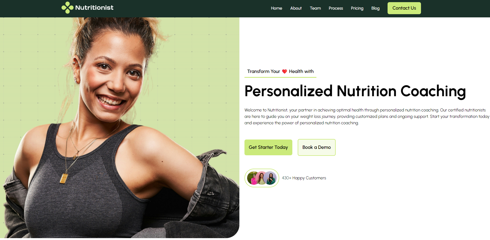

# My First Module Project: HTML, CSS & JavaScript 🎓

Welcome to the project that marks the completion of my first module of learning HTML, CSS, and basic JavaScript! This project is a culmination of my skills in structuring web pages, styling them, and adding a touch of interactivity through JavaScript.

## 📜 Project Overview

This project includes a simple yet structured HTML page, styled with reusable CSS classes, and a JavaScript-based calorie calculator. Users can input their age, height, weight, gender, and activity level to find out how many calories they need to maintain their current weight.

### Key Features

- **Structured HTML**: Emphasis on semantic elements and a clean, organized structure.
- **Reusable CSS Classes**: Focused on using classes efficiently to avoid redundant code.
- **JavaScript Calorie Calculator**: A form-based calculator that takes user inputs to calculate daily caloric needs.
- **Self-Reflection**: Documenting areas of improvement in responsive design and unit usage (px, rem, em, vw, vh).

## 🚀 Technologies Used

- **HTML**: Semantic structure and accessibility considerations.
- **CSS**: Flexbox, grid, reusable classes, and styling techniques.
- **JavaScript**: Functions and Calculations - manipulating HTML with help of JS.

## 🛠 Project Structure

```bash
├── index.html       # Main HTML file
├── style.css        # Main CSS file with reusable classes
├── script.js        # JavaScript file for the calorie calculator
└── assets           # Folder for images and other assets
```

## 🔍 Learning Highlights

1. **HTML Structure**: I focused on using semantic tags like `<header>`, `<main>`, and `<footer>` to create a logical document structure. This practice not only helps with accessibility but also makes the code more readable.

2. **CSS Reusability**: I aimed to minimize redundancy by using a consistent naming convention for classes and reusing them where possible. This project was a great exercise in understanding how to keep CSS manageable and efficient.

3. **JavaScript Integration**: Implementing the calorie calculator was a significant step in integrating JavaScript with HTML forms. I learned to handle user inputs and perform calculations dynamically.

4. **Responsive Design Challenges**: One of my struggles was making the page  responsive. I learned that I need to improve my understanding of when to use different units like `px`, `rem`, `em`, `vw`, and `vh`.

### 📸 Screenshots


## 🌱 Areas for Improvement

- **Responsive Design**: I need to practice using media queries and various CSS units more effectively to create layouts that adapt seamlessly to different screen sizes.
  
- **Unit Usage**: I aim to get a better grasp on choosing the right units (`px` vs `rem` vs `em`, etc.) for various design elements to ensure scalability and responsiveness.

## 💡 Future Development

- Enhance the calorie calculator by adding more advanced features and more elegant style.
- Improve the styling with a responsive grid layout to better adapt to various screen sizes.
- Experiment with CSS animations to make the user interface more engaging.

## 🔗 Links

- **Live Demo**: <a href="https://griez97.github.io/Abschlussprojekt-Frontend-Modul_1-Health-App/" target="_blank">My Live Site Link</a>

## 👩‍💻 About Me

I’m a beginner web developer, passionate about learning new technologies and improving my coding skills. This project is a step forward in my journey to become proficient in frontend development. I welcome any feedback or suggestions!

🧸 Cheers! 🧸 Griez97 🧸